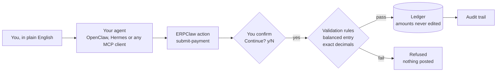

<p align="center">
  <picture>
    <source media="(prefers-color-scheme: dark)" srcset="docs/assets/erpclaw-readme/hero-dark.svg">
    
  </picture>
</p>

<h1 align="center">ERPClaw</h1>

<p align="center">
  <b>The AI-native ERP. Talk to your books in plain English.<br>
  They answer, they act, and they say no when the numbers do not add up.</b>
</p>

<p align="center">
  
  <!-- version badge auto-synced by release/scripts/sync_facts.py (badge URL pattern) -->
  
  
  
  
  <a href="https://www.erpclaw.ai"></a>
</p>

<p align="center">
  <a href="#talk-to-your-books">See it work</a> ·
  <a href="#the-books-say-no">The books say no</a> ·
  <a href="#quick-start">Quick start</a> ·
  <a href="#trusted-with-money">Trusted with money</a> ·
  <a href="https://www.erpclaw.ai">erpclaw.ai</a>
</p>

## Talk to your books

You do not learn screens. You say what happened, and ERPClaw does the bookkeeping: it reads
the ledger to answer questions. In the payment shown below, it asks before posting to the books.

<p align="center">
  
</p>

These are real conversations from a live run on 9 October 2026 against a test company,
Northwind Supplies. The animation shortens the output; the numbers are exactly what the books
returned.

| You say | ERPClaw does |
|---|---|
| *"Who owes us money right now, and how much is overdue?"* | Reads the books. Acme owes **$2,500.00** on INV-2026-00001, due 31 October, so **nothing is overdue**. The books do not change. |
| *"Acme wired $2,450.00 into Checking yesterday against INV-2026-00001 and took the 2 percent early-payment discount. Record it."* | Asks first: `Continue? [y/N]`. After your yes, it records **one payment**: $2,450.00 cash plus a $50.00 early-payment discount to Sales Discounts. Three balanced ledger lines post and the invoice is **paid**. |

## The books say no

<p align="center">
  
</p>

*"Northfield's invoice NF-7781 bills all 300 HX-200 cartridges on PO-2026-00001 at $42.00. Post it."*

The assistant asked, got a yes, and tried to post. The books refused:

```text
Invoice qty exceeds received qty for item 'HX-200 Cartridge'.
Ordered: 300.00, Received: 0, Already invoiced: 0, Current invoice: 300.00
```

That is a three-way match on a bill linked to its purchase order. What you ordered, what arrived,
and what the supplier billed have to agree before that bill reaches the books. Nothing arrived, so **$12,600.00 stayed out of the
ledger**. The check is not an instruction in a prompt that a model can be argued out of. It is a
rule inside the ledger, and the AI cannot talk its way past it. The assistant did the useful thing
instead and offered the next step: record the goods when they arrive, then post the bill.

## Ask what happened

*"Show me everything recorded in the last fifteen minutes."*

```text
02:39:56  create-purchase-invoice   draft bill from PO-2026-00001, $12,600.00   never posted
02:39:09  submit-payment            PAY-2026-00001, 3 ledger lines
02:38:55  update-payment            PAY-2026-00001, amount and allocation set
02:38:20  add-payment               PAY-2026-00001, $2,450.00 received
02:37:00  submit-purchase-order     PO-2026-00001
02:37:00  submit-sales-invoice      INV-2026-00001
          ...and the setup entries before them
```

Each of these changes left a timestamped entry that says what it was and which record it touched.
The refused bill is right there too, as a draft that never reached the ledger.

## Quick start

About five minutes. ERPClaw is one product: install it once, then describe your business and it
sets itself up.

**1. Install** (OpenClaw)

```bash
clawhub install erpclaw
```

This installs the foundation and creates the database on your own machine.

**2. Tell it about your business**

```text
"I'm opening a retail store called Sunrise Goods in Portland, Oregon. Set me up."
→ creates your company, a US GAAP chart of accounts, fiscal year, and tax rates
```

**3. Ask for your industry.** Industry editions arrive the same way, with no second install:

```text
"I'm a school"           → pulls the education edition
"Set me up for a clinic" → pulls clinical practice management
```

<details>
<summary><b>Using Hermes Agent instead (experimental)</b></summary>

```bash
hermes skills tap add avansaber/hermes-skills
hermes skills install avansaber/hermes-skills/skills/erpclaw --force
export ERPCLAW_HOME=~/.hermes/erpclaw-home    # blank = ~/.openclaw/erpclaw
python3 ~/.hermes/skills/erpclaw/scripts/erpclaw-setup/db_query.py --action initialize-database
```

`--force` acknowledges the Hermes security audit's "caution" rating: ERPClaw's accounting engine
runs local commands on your machine by design. Prefer no `--force`? The manual
install works the same way:

```bash
git clone https://github.com/avansaber/erpclaw ~/.hermes/skills/erp/erpclaw
export ERPCLAW_HOME=~/.hermes/erpclaw-home
python3 ~/.hermes/skills/erp/erpclaw/scripts/erpclaw-setup/db_query.py --action initialize-database
```

Then talk to it (keep `ERPCLAW_HOME` exported):
`hermes chat -s erpclaw --yolo -q "Set up my company"`. Recommended:
`hermes curator pin erpclaw` so the skill stays exactly as installed.

</details>

ERPClaw also works through any MCP client.

## What it covers

| Run the business | Industry editions |
|---|---|
| **Books**: double-entry general ledger | Healthcare · Education · Construction |
| **Invoicing** and payments | Legal · Nonprofit · Retail |
| **Inventory** | Hospitality · Property · Agriculture |
| **Purchasing** | Automotive · Food |
| **Payroll** | |
| **Tax** | |

Everything posts to one shared set of books under the same rules.

## Trusted with money

- **Posted amounts can never be edited.** Cancelling posts a reversing entry and marks the original as cancelled, so the history stays whole.
- **Money is exact.** Amounts are exact decimals, never floating point, so cents never drift.
- **The rules live in the ledger.** Balanced entries and the three-way match are checked by the
  books themselves, whichever agent is asking.
- **Every release is cryptographically verified.**
- **Your books stay with you.** Self-hosted: the database lives on your own machine or server, and conversations go only to the AI model you choose.
- **Open source, GPL v3. $0 forever.** No tiers, no per-seat bill.
- **Your database, your agent.** SQLite by default, PostgreSQL fully supported. Works through
  OpenClaw, Hermes, or any MCP client.

## How a sentence becomes ledger entries



## AI-native, not AI added on

Most business software was built for forms and screens, and the AI arrives later as a chat window
on top. ERPClaw was built for agents from the first commit: the conversation is the front door,
and the accounting rules are code that every request has to pass through.

## Coming next

Atrium, the ERPClaw app for Mac. Coming soon to the Mac App Store.

## Links

- **Website:** [erpclaw.ai](https://www.erpclaw.ai)
- **Docs:** [erpclaw.ai/docs](https://www.erpclaw.ai/docs)
- **Stripe Marketplace:** [marketplace.stripe.com/apps/erpclaw-accounting](https://marketplace.stripe.com/apps/erpclaw-accounting)
- **All repositories:** [github.com/avansaber](https://github.com/avansaber)
- **OpenClaw:** [openclaw.org](https://openclaw.org)

## License

GNU General Public License v3. Copyright © 2026 AvanSaber Inc. See [LICENSE.txt](LICENSE.txt).

<p align="center"><sub>Built by AvanSaber Inc.</sub></p>
